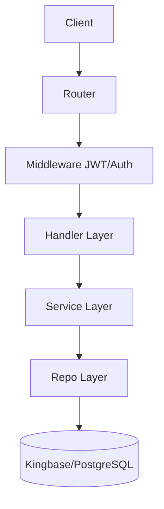
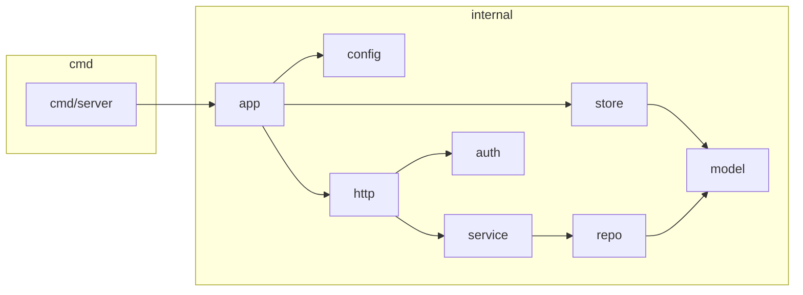
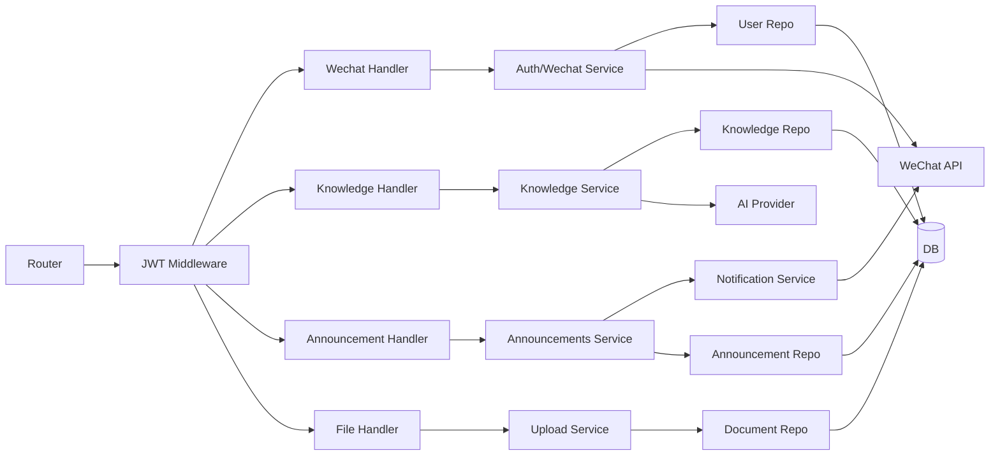
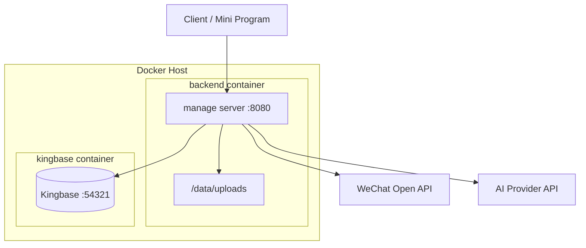
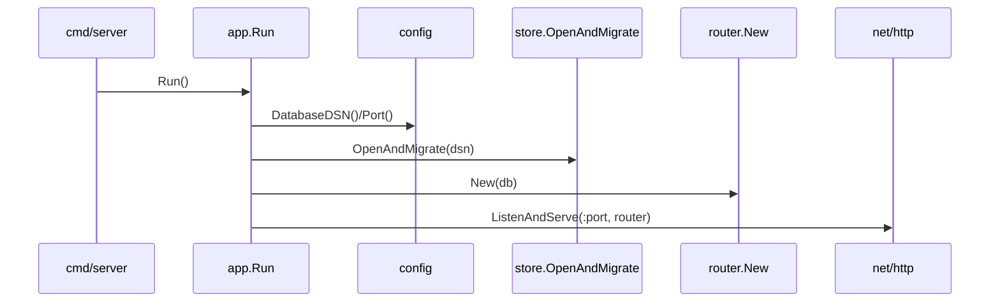
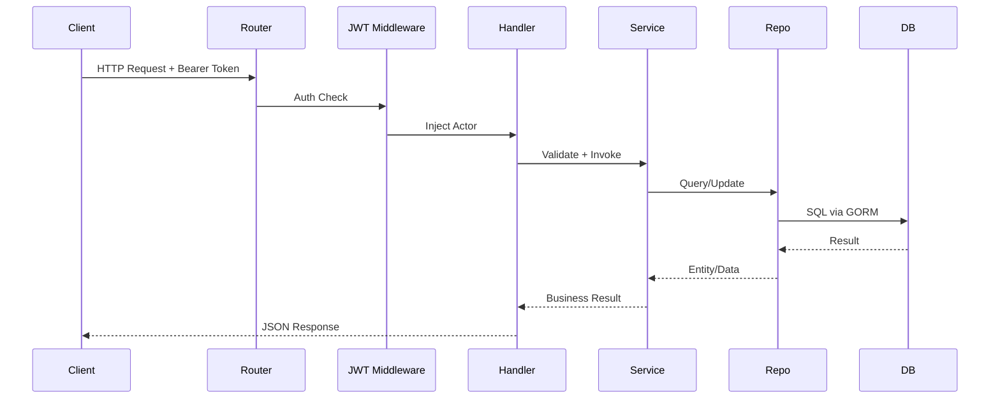

# 信息管理系统后端软件结构设计文档（课程作业版）

## 1. 文档概述

### 1.1 文档目的

本文档用于说明信息管理系统后端的体系结构设计，作为开发、测试、联调和评审的统一依据。文档同时覆盖：
- 软件体系结构设计模型（以 Mermaid 图表达包图/构件图/部署图/时序图）
- 软件体系结构设计规格说明（文字化约束、职责、流程、质量属性）

### 1.2 文档范围

范围限定为仓库 `/home/wuren/info_management` 中 Go 后端服务，包含：
- 认证与授权（微信登录、JWT、RBAC + Scope）
- 用户与班级管理
- 知识库检索与维护
- 文件上传与管理
- 公告发布与通知发送

不包含：
- 前端页面实现（`frontend/`）
- 第三方平台内部实现（微信/OpenRouter）

### 1.3 读者对象

- 架构评审人员
- 后端开发人员
- 测试与联调人员
- 课程作业验收教师

### 1.4 基线信息

- 代码基线日期：2026-04-27
- 技术基线：Go 1.25.0、Gin、GORM、PostgreSQL/Kingbase
- 目录规范依据：`docs/development-standard.md`

## 2. 系统概述

本系统是面向校园/组织场景的统一业务后端，提供标准 REST API。系统通过 JWT 建立身份上下文，并基于角色和数据范围控制访问边界。

### 2.1 系统核心功能

- 身份能力：微信登录、绑定、开发态登录辅助
- 权限能力：学生/班干部/教师/超管四级角色控制
- 数据能力：用户、班级、知识、文件、公告、通知日志等持久化
- 服务能力：知识检索、公告定向发布、订阅通知发送

### 2.2 系统外部参与者

- 小程序或 Web 客户端
- Kingbase/PostgreSQL 数据库
- 微信开放接口（登录、订阅消息）
- AI 服务（知识问答生成）

### 2.3 总体风格

- 架构风格：分层架构 + 模块化领域服务
- 交互风格：HTTP 同步请求为主，外部 API 调用为辅
- 数据风格：关系型数据库为主，JSON 字段补充弹性结构

## 3. 设计目标和原则

### 3.1 设计目标

- 正确性：满足现有 API 功能与权限需求
- 可维护性：分层清晰，业务逻辑可定位
- 可扩展性：支持新增模块（如 `partyflow`/`approvals`）
- 可测试性：Repo/Service/Handler 分层可独立测试
- 可部署性：支持本地启动与 Docker Compose 联调

### 3.2 设计原则

- 单一路由入口：仅 `internal/http/router/router.go` 注册路由
- 业务规则下沉：Handler 不直接承载核心业务
- 权限前置：先鉴权再执行业务
- 数据访问收敛：仅 Repo 层负责 DB 操作
- 配置外置：密钥、DSN、目录通过环境变量注入

## 4. 设计约束和现实限制

### 4.1 强制约束

- API 统一前缀：`/api/v1`
- 统一响应结构：成功 `{"data": ...}`，失败 `{"error": "..."}`
- 数据库连接必须来自 `DATABASE_DSN`
- 受保护接口必须经过：
  1. JWT 解析
  2. Actor 注入
  3. `authz.Authorize` 权限判断
  4. Scope 约束（按业务需要）

### 4.2 环境与第三方约束

- 微信能力依赖：`WECHAT_APP_ID`、`WECHAT_APP_SECRET`
- 消息发送开关：`WECHAT_SUBSCRIBE_MSG_ENABLED`
- AI 生成依赖：`AI_PROVIDER`、`AI_BASE_URL`、`AI_MODEL`、`AI_API_KEY`

### 4.3 现实限制与技术债

- 当 `DATABASE_DSN` 为空时，服务仍可能启动，存在运行期空指针风险。
- 学生侧公告过滤当前采用“批量拉取 + 内存过滤”，高数据量下效率有限。

## 5. 逻辑视点的体系结构设计

### 5.1 分层逻辑模型



### 5.2 UML 包图（Mermaid）



### 5.3 UML 构件图（Mermaid）



### 5.4 关键模块职责

- `router`：统一装配依赖、注册路由、定义公开/鉴权分组
- `middleware`：解析 JWT，注入 `auth.Actor`
- `handler`：参数校验、错误映射、响应输出
- `service`：业务规则、权限决策、跨模块编排
- `repo`：GORM 查询、分页、事务与数据落库
- `model`：表结构与实体定义

## 6. 部署视点的体系结构设计

### 6.1 部署拓扑（Mermaid 部署图）



### 6.2 部署说明

- 后端容器由 `Dockerfile` 构建，暴露 8080。
- 数据库容器由 `docker-compose.yml` 启动，暴露 54321。
- 上传目录使用宿主机卷挂载，保证文件持久化。
- 健康检查：
  - 后端：`/healthz`
  - 数据库：`SELECT 1`

### 6.3 配置策略

- 必需：`DATABASE_DSN`、`JWT_SECRET`
- 外部接口：`WECHAT_*`、`AI_*`
- 文件目录：`DOCUMENT_UPLOAD_DIR`
- 开发辅助：`APP_ENV=dev`

## 7. 开发视点的体系结构设计

### 7.1 代码组织结构

```text
cmd/server
internal/
  app/
  auth/
  config/
  http/
    handler/
    middleware/
    response/
    router/
  model/
  repo/
  service/
    announcements/
    auth/
    authz/
    knowledge/
    notification/
    profile/
    upload/
    wechat/
  store/
tests/
docs/api/
docs/superpowers/
```

### 7.2 依赖方向与约束

- 允许依赖：`handler -> service -> repo -> model`
- 禁止跨层反向依赖（如 repo 调 handler）
- `router` 只做装配，不写业务规则
- 共享能力通过 service 暴露，避免业务模块直接耦合底层实现

### 7.3 开发与测试协作方式

- 模块按 `model/repo/service/handler/docs` 对应落位
- API 变更先更新 `docs/api/*.md`，再改代码
- 质量门槛：
  - `go test ./... -count=1`
  - 必须覆盖权限边界与核心流程

## 8. 运行视点的体系结构设计

### 8.1 启动时序（Mermaid）



### 8.2 典型请求时序（鉴权接口）



### 8.3 运行期质量属性

- 安全性：统一 JWT 鉴权 + 角色动作映射
- 可用性：健康检查接口 + 容器探针
- 可维护性：日志、分层、模块边界清晰
- 可扩展性：新增模块可按统一目录与路由规范扩展

---

## 9. 软件体系结构评审（按作业要求）

### 9.1 满足性

- 结论：基本满足当前需求。
- 依据：认证、权限、知识库、文件、公告、通知均有独立 handler/service/repo 落地；路由与 API 文档一致。

### 9.2 优化性

- 结论：部分满足，存在优化空间。
- 已优化点：分层清晰、共享服务抽取（upload/notification）。
- 待优化点：公告受众匹配下推数据库；无 DSN 启动保护。

### 9.3 可扩展性

- 结论：满足。
- 依据：模块目录标准化，依赖方向固定，便于新增业务域。

### 9.4 可追踪性

- 结论：满足。
- 依据：需求能力可追溯到 API、service、repo 和 model。

需求追踪示例矩阵：

| 需求能力 | API 示例 | Service | Repo/Model |
|---|---|---|---|
| 登录与身份 | `/api/v1/wechat/login` | `service/wechat`, `service/auth` | `repo/user_repo`, `model/user` |
| 知识检索 | `/api/v1/knowledge/search` | `service/knowledge` | `repo/knowledge_repo`, `model/knowledge_item` |
| 文件上传 | `/api/v1/files/upload` | `service/upload` | `repo/document_repo`, `model/document` |
| 公告发布 | `/api/v1/admin/announcements/:id/publish` | `service/announcements` | `repo/announcement_repo`, `model/announcement` |
| 订阅通知 | `/api/v1/admin/notification/templates` | `service/notification` | `notification repo`, `model/notification_*` |

### 9.5 详尽程度

- 结论：满足课程作业“结构设计文档 + 结构设计模型”要求。
- 说明：已覆盖 8 大章节，且提供包图/构件图/部署图/时序图与评审结论。

---

## 10. 后续改进建议

1. 在启动阶段强制校验 `DATABASE_DSN`，避免空 DB 启动。
2. 公告定向匹配改造为数据库侧过滤，降低内存与时延开销。
3. 补充统一架构决策记录（ADR），提升演进过程可审计性。
