# 信息管理系统软件设计规格说明书

文档编号：信息管理系统 - SDS - 1.0

项目名称：信息管理系统

日期：2026-05-09

## 文档变更历史记录

| 序号 | 变更日期 | 变更人员 | 变更内容详情描述 | 版本 |
|---|---|---|---|---|
| 1 | 2026-05-09 | Codex | 根据当前系统实现编写当前后端系统设计规格说明书 | 1.0 |

## 目录

1. 引言  
   1.1 编写目的  
   1.2 读者对象  
   1.3 软件项目概述  
   1.4 文档概述  
   1.5 定义  
   1.6 参考资料  
2. 软件设计约束  
   2.1 软件设计目标和原则  
   2.2 软件设计的约束和限制  
3. 软件设计  
   3.1 软件体系结构设计  
   3.2 用户界面设计  
   3.3 用例设计  
   3.4 类设计  
   3.5 数据设计  
   3.6 部署设计  

## 1、引言

### 1.1 编写目的

本文档依据 `docs/reference/软件设计文档模板.md` 编写，用于说明信息管理系统当前后端软件的总体设计、模块边界、数据结构、关键用例、部署方式与主要约束。文档作为后续开发、测试、联调、课程验收和维护的统一设计依据。

### 1.2 读者对象

本文档面向以下人员：

- 后端开发人员：理解模块划分、依赖方向、接口边界和数据设计。
- 前端或小程序开发人员：理解后端提供的业务能力、认证方式和主要交互流程。
- 测试人员：依据用例、权限边界和数据设计编写测试用例。
- 部署运维人员：理解运行环境、配置项、数据库和文件目录要求。
- 项目评审人员：评估系统设计是否满足需求、是否具备可维护性和可扩展性。

### 1.3 软件项目概述

项目名称为“信息管理系统”，后端工程名为 `Manage Backend`。项目面向学院学生事务管理场景，目标是提供一个统一的后端服务，支撑学生端与管理员端完成身份认证、权限控制、知识库检索、文件管理、公告发布、订阅通知、审批流程等业务。

项目主要用户包括：

- 学生：查询个人信息、检索政策知识、下载文件、查看公告、提交审批申请。
- 班干部或团干部：在授权范围内参与信息发布、审批和班级事务管理。
- 教师或班主任：查看所负责班级或年级的数据，参与管理与审核。
- 超级管理员：维护用户、班级、知识库、公告、通知模板和全局数据。

当前仓库重点实现后端服务，不包含完整前端页面实现。系统通过 REST API 对外提供能力，数据库使用 PostgreSQL 兼容的 Kingbase，测试环境使用 SQLite in-memory。

### 1.4 文档概述

本文档分为三个部分：

- 第 1 章说明文档目的、项目背景、读者对象、术语和参考资料。
- 第 2 章说明软件设计目标、设计原则、技术约束、环境约束和安全限制。
- 第 3 章说明系统架构、用户界面接口边界、核心用例、类与模块设计、数据设计和部署设计。

### 1.5 定义

| 术语 | 定义 |
|---|---|
| Actor | JWT 中间件解析出的当前请求身份上下文，包含用户 ID、角色、班级、年级等信息。 |
| RBAC | Role-Based Access Control，基于角色的访问控制。 |
| Scope | 数据范围约束，用于限制用户只能访问本角色授权范围内的数据，例如本班、本年级或全局。 |
| Handler | HTTP 入口层，负责参数解析、调用 service 和统一响应。 |
| Service | 业务服务层，负责业务规则、权限编排和跨 repo 调用。 |
| Repo | 数据访问层，负责 GORM 查询、分页、持久化和数据库细节封装。 |
| Model | 数据模型层，定义数据库表结构和实体字段。 |
| Kingbase | 人大金仓数据库，当前作为 PostgreSQL 兼容数据库使用。 |
| JSONB | PostgreSQL/Kingbase 的 JSON 二进制字段类型，用于保存弹性结构数据。 |
| SDS | Software Design Specification，软件设计规格说明书。 |

### 1.6 参考资料

- `docs/reference/软件设计文档模板.md`
- `docs/development-standard.md`
- `README.md`
- `docs/software-architecture-design.md`
- `original_request/初始需求.md`
- `original_request/技术方案.md`
- `docs/api/phase1-foundation-api.md`
- `docs/api/phase2-files-api.md`
- `docs/api/phase2-knowledge-api.md`
- `docs/api/phase2-wechat-api.md`
- `docs/api/phase2-approvals-api.md`
- `docs/api/phase2-announcements-api.md`
- `docs/api/notification-api.md`

## 2、软件设计约束

### 2.1 软件设计目标和原则

#### 2.1.1 设计目标

系统设计目标如下：

- 功能完整性：满足学生事务场景下的身份认证、用户班级管理、知识库、文件、公告通知、审批等核心需求。
- 安全性：通过 JWT、RBAC 和 Scope 控制接口访问和数据访问边界。
- 可维护性：采用分层架构，保持 handler、service、repo、model 职责清晰。
- 可扩展性：新增业务模块时按统一目录规范落位，减少对既有模块的影响。
- 可测试性：通过 SQLite in-memory 支持 repo、service、handler 测试，重点覆盖权限与范围边界。
- 可部署性：支持本地开发、Docker Compose 联调和 Kingbase/PostgreSQL 部署。

#### 2.1.2 设计原则

系统遵循以下原则：

- 单一路由入口：所有 API 路由统一在 `internal/http/router/router.go` 注册。
- 分层依赖：依赖方向保持为 `handler -> service -> repo -> model`。
- 业务规则下沉：handler 只处理 HTTP 相关逻辑，核心业务规则放入 service。
- 数据访问收敛：repo 层负责数据库查询和持久化，业务层不直接拼接数据库逻辑。
- 权限前置：受保护接口必须先经过 JWT 解析、角色授权和数据范围约束。
- 配置外置：数据库连接串、JWT 密钥、微信配置、上传目录等通过环境变量注入。
- 共享能力复用：文件上传、通知发送、权限判断等能力集中在共享 service 中复用。

### 2.2 软件设计的约束和限制

#### 2.2.1 技术栈约束

| 类型 | 约束 |
|---|---|
| 开发语言 | Go 1.25.0 |
| Web 框架 | Gin |
| ORM | GORM |
| 生产/联调数据库 | PostgreSQL / Kingbase PostgreSQL 兼容模式 |
| 测试数据库 | SQLite in-memory |
| API 风格 | REST API |
| 响应格式 | 成功返回 `{"data": ...}`，失败返回 `{"error": "..."}` |

#### 2.2.2 运行环境约束

- 后端默认监听端口为 `8080`，可通过 `PORT` 环境变量覆盖。
- 数据库连接串只允许通过 `DATABASE_DSN` 注入，禁止硬编码。
- JWT 签名密钥通过 `JWT_SECRET` 注入，生产环境必须设置。
- 上传目录通过 `DOCUMENT_UPLOAD_DIR` 注入，容器部署时挂载到 `/data/uploads`。
- 微信登录与订阅通知依赖 `WECHAT_APP_ID`、`WECHAT_APP_SECRET` 等配置。
- AI 问答生成能力依赖 `AI_PROVIDER`、`AI_BASE_URL`、`AI_MODEL`、`AI_API_KEY` 等配置。

#### 2.2.3 权限约束

受保护接口的标准处理流程为：

1. JWT 中间件解析 `Authorization: Bearer <token>`。
2. 中间件注入 `auth.Actor`。
3. service 或 handler 获取当前 Actor。
4. 通过 `authz.Authorize(actor.Role, action)` 判断动作权限。
5. 通过 `authz.BuildScope(actor)` 构造数据范围。
6. repo 查询或更新时应用 Scope。

角色分为普通学生、班干部/团干部、教师/班主任、超级管理员等层级。学生一般只能访问个人数据和公开/定向发布给自己的数据；管理员根据角色访问本班、本年级或全局数据。

#### 2.2.4 数据约束

- `classes.grade` 是年级事实源。
- `users.grade` 是系统维护快照，用于兼容与查询性能。
- 业务接口不得直接修改 `users.grade`，年级变更应通过班级或同步逻辑完成。
- 变化频繁或结构弹性较强的字段优先使用 JSONB。
- 开发阶段允许通过 `AutoMigrate` 追加模型，但禁止删除既有迁移调用。

#### 2.2.5 已知限制

- 当前项目重点覆盖后端能力，不包含完整前端 UI 实现。
- 公告学生侧过滤存在内存过滤场景，大数据量下可优化为数据库侧过滤。
- 当外部微信、AI 服务不可用时，相关功能受影响，但核心数据库类接口仍可运行。

## 3、软件设计

### 3.1 软件体系结构设计

#### 3.1.1 总体架构

系统采用分层架构与模块化领域服务组合的设计。客户端通过 HTTP 调用后端 API，后端经过路由、中间件、handler、service、repo 层处理后访问数据库或外部服务。

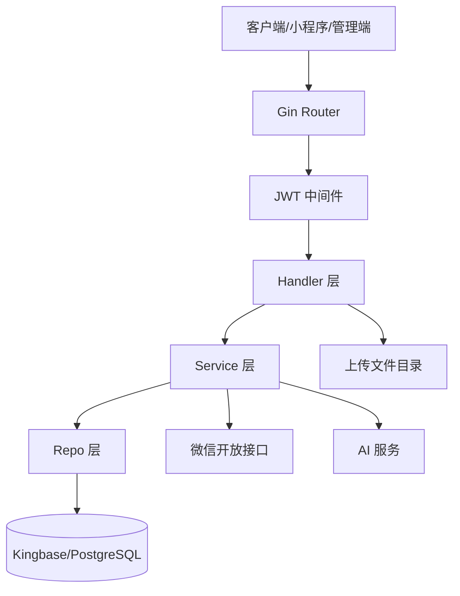

#### 3.1.2 包结构设计

```text
cmd/server/                     进程入口
internal/app/                   应用启动编排
internal/auth/                  身份上下文 Actor
internal/config/                环境变量配置读取
internal/store/                 数据库连接与迁移
internal/model/                 数据模型
internal/repo/                  数据访问
internal/service/               业务服务
internal/http/handler/          HTTP handler
internal/http/middleware/       中间件
internal/http/response/         统一响应
internal/http/router/           单一路由入口
tests/                          集成/契约测试
docs/api/                       API 文档
```

包依赖关系如下：

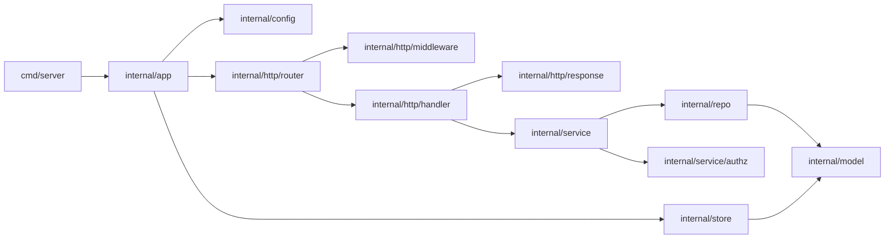

#### 3.1.3 模块职责

| 模块 | 主要职责 |
|---|---|
| `cmd/server` | 启动应用进程。 |
| `internal/app` | 读取配置、打开数据库、初始化路由、启动 HTTP 服务。 |
| `internal/config` | 封装环境变量读取逻辑。 |
| `internal/store` | 打开数据库连接并执行 AutoMigrate。 |
| `internal/auth` | 定义请求身份 Actor。 |
| `internal/service/auth` | JWT 签发、开发态登录等认证辅助能力。 |
| `internal/service/authz` | 角色动作授权和 Scope 构造。 |
| `internal/service/wechat` | 微信登录、绑定、公共注册。 |
| `internal/service/profile` | 个人资料查询与更新。 |
| `internal/service/upload` | 统一文件上传、存储、检索、下载与删除。 |
| `internal/service/knowledge` | 知识库检索、文档抽取、AI 问答生成。 |
| `internal/service/announcements` | 公告创建、发布、归档和受众匹配。 |
| `internal/service/approvals` | 审批申请、审核、撤回、指派、催办。 |
| `internal/service/notification` | 微信订阅通知模板、日志和发送编排。 |
| `internal/service/audit` | 管理操作审计日志。 |
| `internal/repo` | 用户、班级、知识、文件、公告、审批等数据访问。 |
| `internal/model` | 数据库实体定义。 |
| `internal/http/router` | 注册 `/api/v1` 下全部路由。 |

#### 3.1.4 运行时请求流程

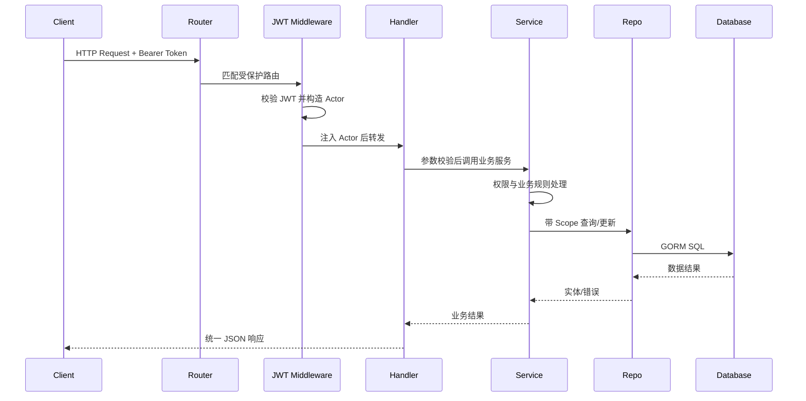

### 3.2 用户界面设计

当前仓库不包含完整前端页面实现，因此本文档从后端视角描述用户界面交互边界。前端可包括微信小程序学生端和 PC 管理端，两端均通过 REST API 与后端通信。

#### 3.2.1 学生端界面边界

学生端建议包含以下页面或功能入口：

| 页面/功能 | 后端接口 |
|---|---|
| 登录/绑定 | `POST /api/v1/wechat/login`、`POST /api/v1/wechat/bind` |
| 个人资料 | `GET /api/v1/me`、`PATCH /api/v1/me`、`GET /api/v1/profile/home` |
| 知识库搜索 | `GET /api/v1/knowledge/search`、`GET /api/v1/knowledge/:id` |
| 公告列表与详情 | `GET /api/v1/announcements`、`GET /api/v1/announcements/:id` |
| 文件查询与下载 | `GET /api/v1/files`、`GET /api/v1/files/:id/download` |
| 审批申请 | `POST /api/v1/approvals`、`GET /api/v1/approvals/me` |
| 订阅上报 | `POST /api/v1/user/subscribe/report` |

学生端典型页面跳转关系如下：

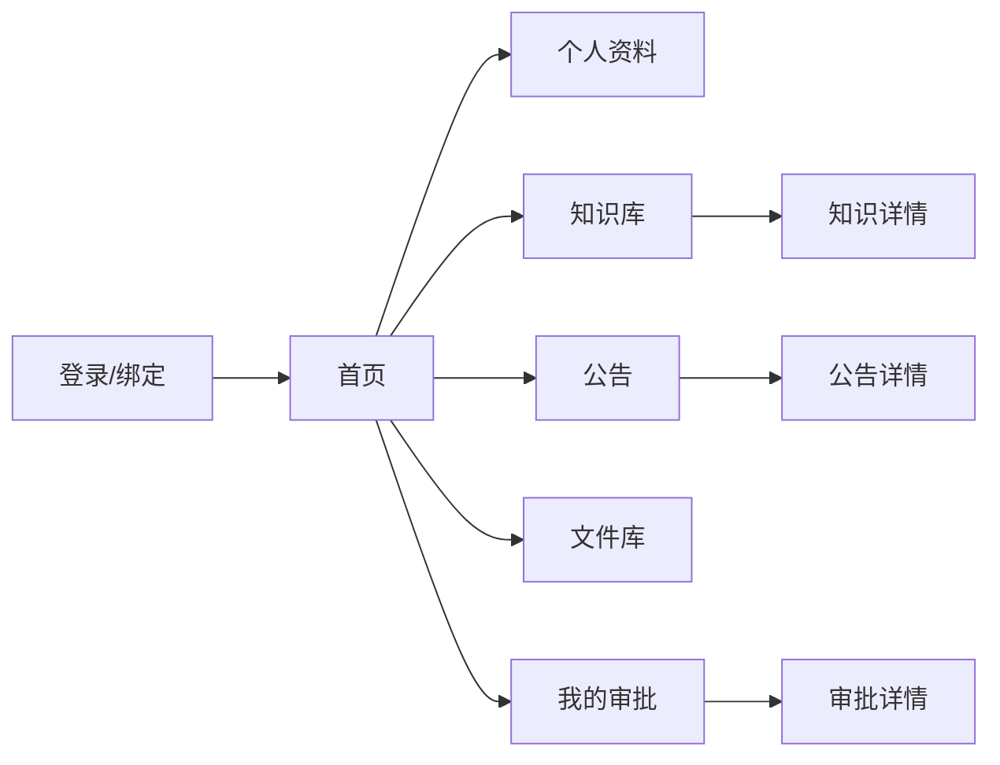

#### 3.2.2 管理端界面边界

管理端建议包含以下页面或功能入口：

| 页面/功能 | 后端接口 |
|---|---|
| 用户管理 | `GET /api/v1/admin/users`、`PATCH /api/v1/admin/users/:id`、`POST /api/v1/admin/users/import` |
| 班级管理 | `GET /api/v1/admin/classes`、`POST /api/v1/admin/classes`、`PATCH /api/v1/admin/classes/:id` |
| 知识库管理 | `/api/v1/admin/knowledge` 相关接口 |
| 文件管理 | `/api/v1/files` 相关接口 |
| 公告管理 | `/api/v1/admin/announcements` 相关接口 |
| 审批管理 | `/api/v1/admin/approvals` 相关接口 |
| 通知模板与日志 | `/api/v1/admin/notification/templates`、`/api/v1/admin/notification/logs` |
| 操作日志 | `GET /api/v1/admin/logs` |

管理端典型页面跳转关系如下：

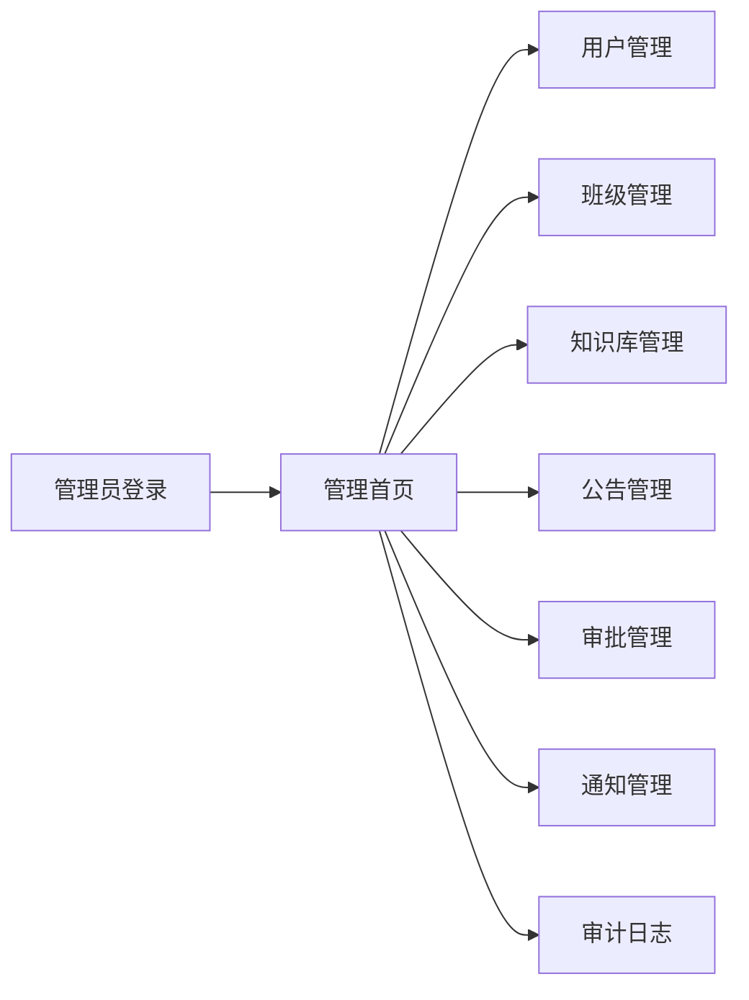

#### 3.2.3 交互响应设计

- 成功响应统一返回 `{"data": ...}`。
- 失败响应统一返回 `{"error": "错误信息"}`。
- 列表响应建议返回 `{"data": [...], "total": N}`。
- 登录后前端保存 JWT，并在受保护请求中携带 `Authorization: Bearer <token>`。
- 文件下载通过 `/api/v1/files/:id/download` 或静态 `/uploads` 路径完成。

### 3.3 用例设计

#### 3.3.1 用例总览

```mermaid
flowchart TB
    Student[学生]
    Cadre[班干部/团干部]
    Teacher[教师/班主任]
    Admin[超级管理员]

    Login[登录与绑定]
    Profile[维护个人资料]
    SearchKnowledge[检索知识库]
    ViewAnnouncement[查看公告]
    SubmitApproval[提交审批申请]
    ManageUsers[管理用户]
    ManageClasses[管理班级]
    ManageKnowledge[维护知识库]
    ManageFiles[管理文件]
    PublishAnnouncement[发布公告]
    ReviewApproval[审核审批]
    ManageNotification[维护通知模板]
    ViewLogs[查看审计日志]

    Student --> Login
    Student --> Profile
    Student --> SearchKnowledge
    Student --> ViewAnnouncement
    Student --> SubmitApproval
    Cadre --> PublishAnnouncement
    Cadre --> ReviewApproval
    Teacher --> ManageClasses
    Teacher --> ViewAnnouncement
    Admin --> ManageUsers
    Admin --> ManageClasses
    Admin --> ManageKnowledge
    Admin --> ManageFiles
    Admin --> PublishAnnouncement
    Admin --> ReviewApproval
    Admin --> ManageNotification
    Admin --> ViewLogs
```

#### 3.3.2 用例：微信登录

| 项目 | 内容 |
|---|---|
| 参与者 | 学生、管理员、微信开放接口 |
| 前置条件 | 用户已在系统中存在，或使用公共注册/绑定流程补充信息 |
| 触发方式 | 前端提交微信登录 code |
| 主流程 | handler 接收 code；service 调用微信接口换取 openid；系统查找或绑定用户；签发 JWT；返回用户身份与 token |
| 异常流程 | code 无效返回 400/401；微信接口异常返回 500；用户未绑定时返回需绑定状态 |
| 后置条件 | 前端获得 token，后续请求携带 Bearer token |

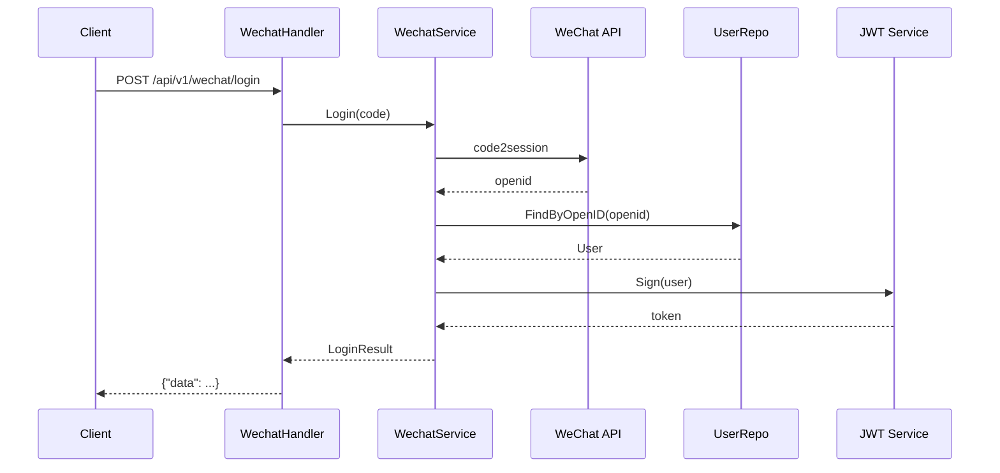

#### 3.3.3 用例：知识库检索

| 项目 | 内容 |
|---|---|
| 参与者 | 学生、管理员 |
| 前置条件 | 用户已登录，知识库中存在已录入条目 |
| 触发方式 | 前端提交关键词 |
| 主流程 | handler 校验查询参数；service 构造检索条件；repo 在 question、answer、keywords、content_text 范围内检索；返回匹配条目 |
| 异常流程 | 参数为空返回 400；数据库异常返回 500 |
| 后置条件 | 用户获得知识条目摘要或详情 |

#### 3.3.4 用例：文件上传与下载

| 项目 | 内容 |
|---|---|
| 参与者 | 已登录用户、管理员 |
| 前置条件 | 用户已登录且具备文件上传/管理权限 |
| 触发方式 | 前端提交 multipart 文件 |
| 主流程 | handler 接收文件；upload service 保存文件到配置目录；抽取必要元数据；document repo 保存记录；下载时按文件 ID 查找记录并返回文件 |
| 异常流程 | 文件为空或过大返回 400；无权限返回 403；文件不存在返回 404 |
| 后置条件 | 系统生成文件记录，其他模块可通过 `file_id` 引用 |

#### 3.3.5 用例：公告发布与查看

| 项目 | 内容 |
|---|---|
| 参与者 | 管理员、教师、班干部、学生 |
| 前置条件 | 发布者已登录并具备公告管理权限 |
| 触发方式 | 管理端创建并发布公告 |
| 主流程 | 创建草稿；设置标题、正文、标签、附件、目标范围；发布公告；系统记录发布时间；学生按角色和范围查看公告 |
| 异常流程 | 权限不足返回 403；公告不存在返回 404；状态非法返回 400 |
| 后置条件 | 公告状态变为 published，可被目标用户查询 |

#### 3.3.6 用例：审批申请与审核

| 项目 | 内容 |
|---|---|
| 参与者 | 学生、审批人、管理员 |
| 前置条件 | 学生已登录，审批类型受系统支持 |
| 触发方式 | 学生提交申请表单 |
| 主流程 | 学生创建审批；系统保存申请与动作日志；审批人查询待处理申请；审批人通过或驳回；系统更新状态与历史动作 |
| 异常流程 | 申请人撤回已完结审批返回 400；非审批人审核返回 403；审批不存在返回 404 |
| 后置条件 | 审批状态变更为 approved、rejected、withdrawn 或保持 pending |

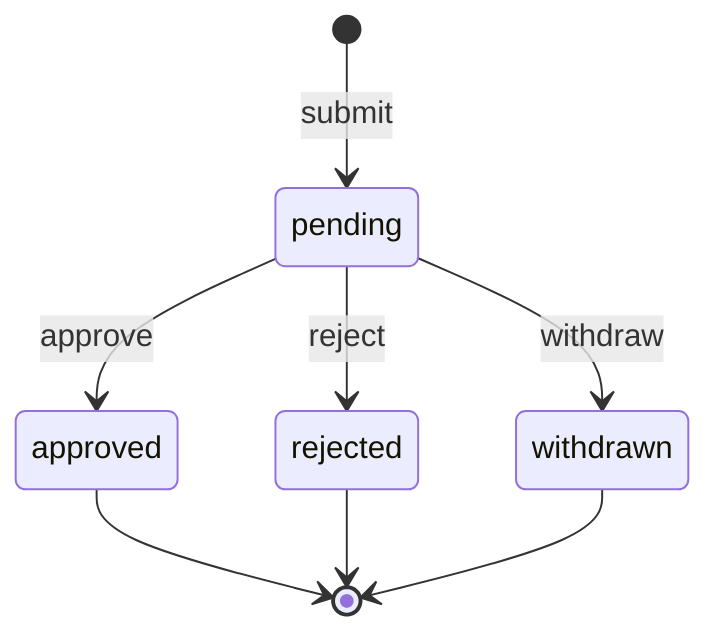

### 3.4 类设计

Go 项目中“类”主要由 struct、interface 和方法组合实现。本节按核心实体、服务和仓储职责描述类设计。

#### 3.4.1 核心实体类

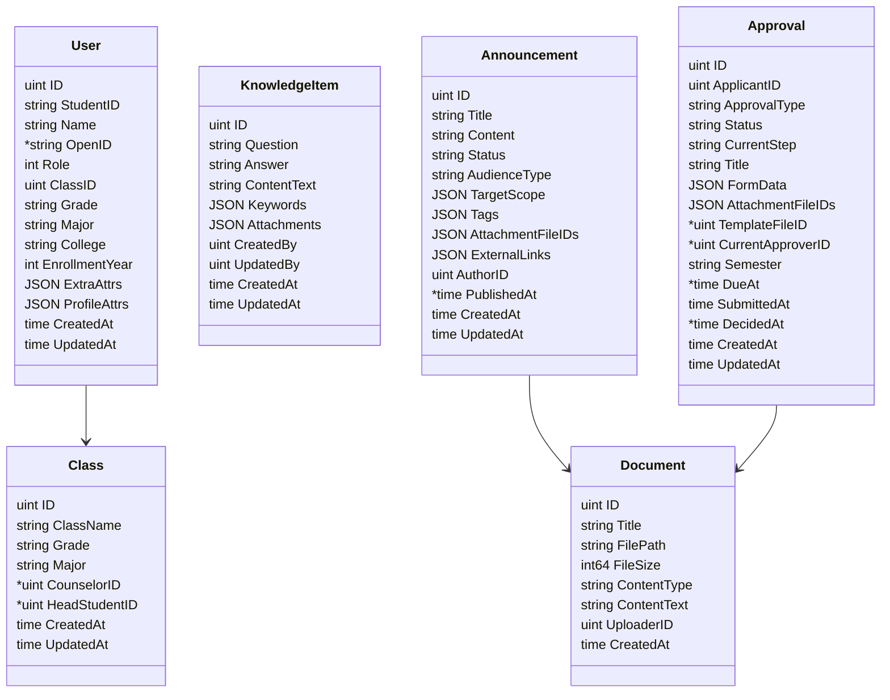

#### 3.4.2 服务类设计

| 服务 | 可见范围 | 主要方法类别 | 依赖 |
|---|---|---|---|
| WechatService | `internal/service/wechat` | 登录、绑定、公共注册 | UserRepo、JWT、微信客户端 |
| AuthService | `internal/service/auth` | JWT 签发、开发态登录 | config、UserRepo |
| Authz | `internal/service/authz` | 动作授权、Scope 构造 | Actor、角色常量 |
| ProfileService | `internal/service/profile` | 个人资料查询与更新 | UserRepo、ClassRepo |
| UploadService | `internal/service/upload` | 上传、列表、检索、下载、删除 | DocumentRepo、文件系统 |
| KnowledgeService | `internal/service/knowledge` | 检索、文档抽取、AI 生成预览 | KnowledgeRepo、AttachmentRepo、AI Provider |
| AnnouncementsService | `internal/service/announcements` | 创建、修改、发布、归档、列表 | AnnouncementRepo、NotificationService |
| ApprovalsService | `internal/service/approvals` | 创建、撤回、审核、指派、催办 | ApprovalRepo、UserRepo、NotificationService |
| NotificationService | `internal/service/notification` | 模板、日志、订阅消息发送 | NotificationRepo、WechatClient |
| AuditLogger | `internal/service/audit` | 管理操作日志记录 | AdminLogRepo |

服务层对 handler 暴露面向业务的输入输出结构，隐藏 repo 查询细节和外部接口差异。

#### 3.4.3 仓储类设计

| Repo | 主要职责 |
|---|---|
| UserRepo | 用户按 ID、学号、openid 查询，用户列表、导入和更新。 |
| ClassRepo | 班级创建、查询、修改和默认班级处理。 |
| KnowledgeRepo | 知识条目增删改查、关键词/全文检索。 |
| KnowledgeAttachmentRepo | 知识条目与文件附件绑定关系维护。 |
| DocumentRepo | 文件元数据保存、查询、搜索和删除。 |
| AnnouncementRepo | 公告草稿、发布、归档、受众列表查询。 |
| ApprovalRepo | 审批申请、审批动作、待处理列表和逾期扫描。 |
| AdminLogRepo | 管理操作日志写入和查询。 |
| NotificationRepo | 通知模板、通知日志、未读计数。 |

#### 3.4.4 权限相关类设计

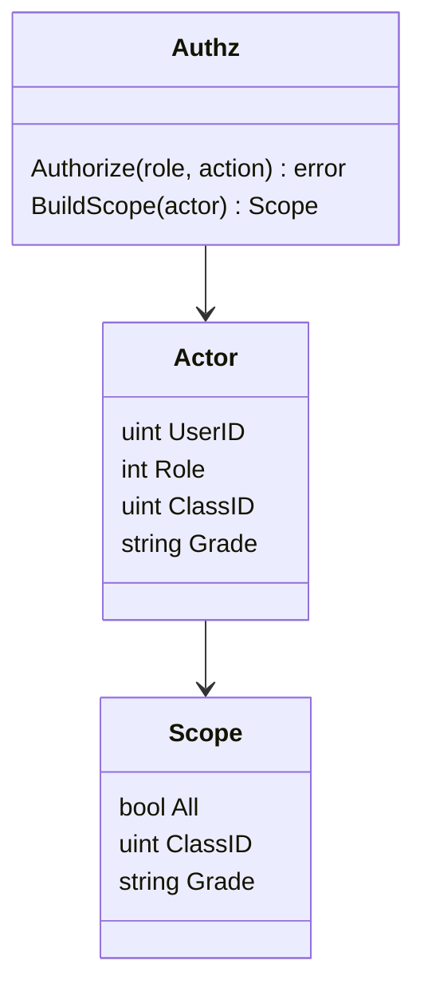

权限设计要求业务模块不要绕过 `authz + scope` 全量查询数据。

### 3.5 数据设计

#### 3.5.1 数据库设计概述

系统使用 GORM 定义模型，并由 `internal/store/db.go` 在启动时执行 AutoMigrate。当前迁移模型包括：

- `User`
- `Class`
- `AdminLog`
- `KnowledgeItem`
- `KnowledgeAttachment`
- `Document`
- `NotificationTemplate`
- `NotificationLog`
- `UserSubscribe`
- `Announcement`
- `Approval`
- `ApprovalAction`

数据库使用 Kingbase/PostgreSQL 兼容模式。测试中使用 SQLite in-memory。

#### 3.5.2 主要数据表

##### users

| 字段 | 类型/含义 | 约束 |
|---|---|---|
| id | 用户 ID | 主键 |
| student_id | 学号 | 唯一、非空 |
| name | 姓名 | 非空 |
| open_id | 微信 OpenID | 可空 |
| password_hash | 密码哈希 | 可空，响应隐藏 |
| role | 角色 | 非空、索引 |
| class_id | 班级 ID | 索引 |
| grade | 年级快照 | 非空、默认 2024、索引 |
| major | 专业 | 可空 |
| college | 学院 | 可空 |
| enrollment_year | 入学年份 | 索引 |
| extra_attrs | 扩展属性 | JSONB |
| profile_attrs | 个人资料扩展 | JSONB |
| created_at / updated_at | 创建/更新时间 | 自动维护 |

##### classes

| 字段 | 类型/含义 | 约束 |
|---|---|---|
| id | 班级 ID | 主键 |
| class_name | 班级名称 | 非空、索引 |
| grade | 年级 | 索引 |
| major | 专业 | 索引 |
| counselor_id | 班主任用户 ID | 可空 |
| head_student_id | 班长/团支书用户 ID | 可空 |
| created_at / updated_at | 创建/更新时间 | 自动维护 |

##### knowledge_items

| 字段 | 类型/含义 | 约束 |
|---|---|---|
| id | 知识条目 ID | 主键 |
| question | 问题 | text、非空 |
| answer | 标准答案 | text、非空 |
| content_text | 文档抽取正文 | text |
| keywords | 关键词 | JSONB |
| attachments | 附件信息 | JSONB |
| created_by | 创建人 | 索引、非空 |
| updated_by | 更新人 | 索引、非空 |
| created_at / updated_at | 创建/更新时间 | 自动维护 |

##### documents

| 字段 | 类型/含义 | 约束 |
|---|---|---|
| id | 文件 ID | 主键 |
| title | 文件标题 | 非空 |
| file_path | 文件路径 | 非空 |
| file_size | 文件大小 | 非空 |
| content_type | MIME 类型 | 非空 |
| content_text | 抽取文本 | text |
| uploader_id | 上传人 | 索引、非空 |
| created_at | 上传时间 | 自动维护 |

##### announcements

| 字段 | 类型/含义 | 约束 |
|---|---|---|
| id | 公告 ID | 主键 |
| title | 标题 | 非空 |
| content | 正文 | 非空 |
| status | 状态：draft/published/archived | 非空、索引 |
| audience_type | 受众类型：all/targeted | 非空 |
| target_scope | 目标范围 | JSONB |
| tags | 标签 | JSONB |
| attachment_file_ids | 附件文件 ID 列表 | JSONB |
| external_links | 外部链接 | JSONB |
| author_id | 作者 ID | 索引、非空 |
| published_at | 发布时间 | 可空 |
| created_at / updated_at | 创建/更新时间 | 自动维护 |

##### approvals

| 字段 | 类型/含义 | 约束 |
|---|---|---|
| id | 审批 ID | 主键 |
| applicant_id | 申请人 ID | 索引、非空 |
| approval_type | 审批类型 | 索引、非空 |
| status | 状态 | 索引、非空 |
| current_step | 当前步骤 | 索引 |
| title | 标题 | 非空 |
| form_data | 表单数据 | JSONB |
| attachment_file_ids | 附件文件 ID | JSONB |
| template_file_id | 模板文件 ID | 可空、索引 |
| current_approver_id | 当前审批人 | 可空、索引 |
| semester | 学期 | 索引、非空 |
| due_at | 截止时间 | 可空、索引 |
| submitted_at | 提交时间 | 非空 |
| decided_at | 完结时间 | 可空 |
| created_at / updated_at | 创建/更新时间 | 自动维护 |

##### approval_actions

| 字段 | 类型/含义 | 约束 |
|---|---|---|
| id | 动作 ID | 主键 |
| approval_id | 审批 ID | 索引、非空 |
| action_type | 动作类型 | 非空 |
| operator_id | 操作人 ID | 索引、非空 |
| from_status | 原状态 | 可空 |
| to_status | 新状态 | 可空 |
| comment | 备注 | 可空 |
| snapshot | 操作快照 | JSONB |
| created_at | 创建时间 | 自动维护 |

#### 3.5.3 数据关系

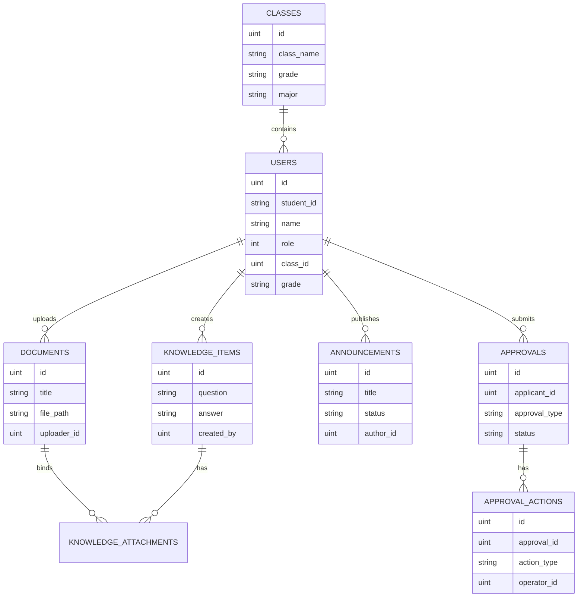

#### 3.5.4 数据操作设计

- 查询类接口默认支持分页参数 `limit`、`offset`。
- 管理端查询必须结合角色动作授权和 Scope。
- 文件上传先落文件系统，再保存 `documents` 元数据；业务模块通过 `file_id` 引用文件。
- 审批状态变更时同时写入 `approval_actions`，保留操作轨迹。
- 公告发布时更新 `status` 和 `published_at`，后续学生侧只查询已发布且符合受众范围的数据。

### 3.6 部署设计

#### 3.6.1 部署拓扑

系统支持本地运行和 Docker Compose 部署。Docker Compose 中包含后端服务和 Kingbase 数据库服务。

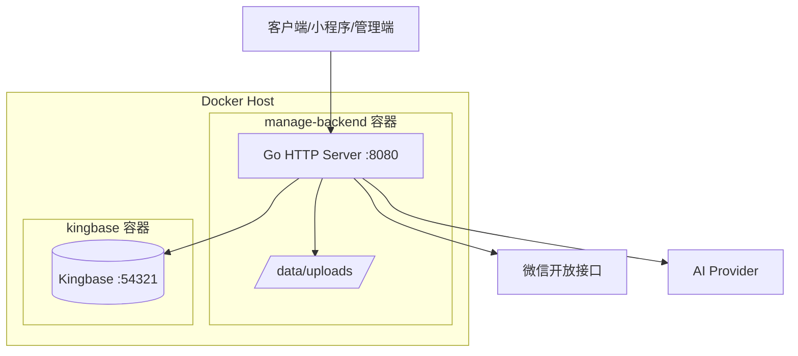

#### 3.6.2 部署组件

| 组件 | 说明 |
|---|---|
| 后端服务 | Go 编译产物，监听 8080，提供 `/healthz` 和 `/api/v1`。 |
| Kingbase 数据库 | PostgreSQL 兼容模式，默认容器端口 54321。 |
| 上传目录 | 容器内 `/data/uploads`，建议挂载宿主机目录持久化。 |
| 微信开放接口 | 用于微信登录、openid 获取和订阅消息发送。 |
| AI 服务 | 用于知识库问答生成预览，可按配置启用。 |

#### 3.6.3 配置项

| 环境变量 | 用途 | 必需性 |
|---|---|---|
| `PORT` | 后端监听端口 | 可选，默认 8080 |
| `DATABASE_DSN` | 数据库连接串 | 必需 |
| `JWT_SECRET` | JWT 签名密钥 | 生产必需 |
| `DOCUMENT_UPLOAD_DIR` | 文件上传目录 | 建议设置 |
| `WECHAT_APP_ID` | 微信应用 ID | 微信能力必需 |
| `WECHAT_APP_SECRET` | 微信应用密钥 | 微信能力必需 |
| `WECHAT_SUBSCRIBE_MSG_ENABLED` | 订阅消息发送开关 | 可选 |
| `AI_PROVIDER` | AI 服务提供方 | AI 能力必需 |
| `AI_BASE_URL` | AI 服务地址 | AI 能力必需 |
| `AI_MODEL` | AI 模型名 | AI 能力必需 |
| `AI_API_KEY` | AI 服务密钥 | AI 能力必需 |

#### 3.6.4 启动流程

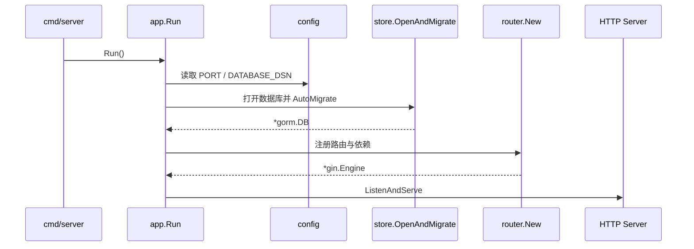

#### 3.6.5 健康检查与验证

- 后端健康检查：`GET /healthz`。
- 数据库健康检查：`SELECT 1`。
- 合并前建议执行：`go test ./... -count=1`。
- 金仓检索链路建议执行集成测试，验证建表、迁移、插入、检索命中和检索无命中。

